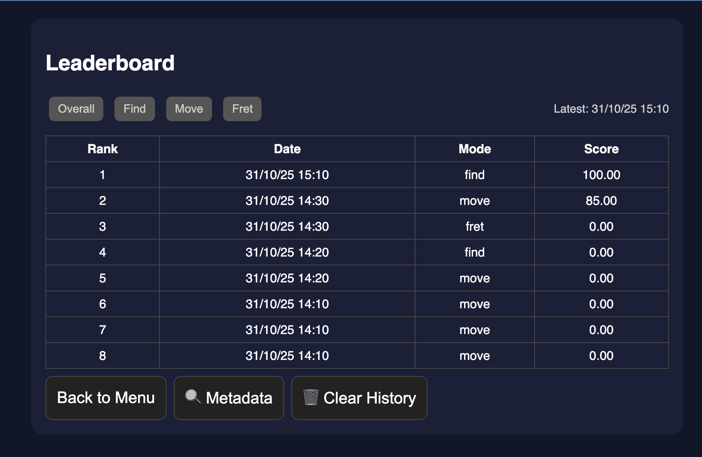

# music-quiz-app
training game to improve transcription ability

# 🎵 Music Quiz App

An interactive **theory quiz and ear-training tool**.  
It challenges users to identify musical notes, intervals, and fretboard positions — with live scoring, timers, and a persistent leaderboard saved in local storage.

This project demonstrates **clean front-end logic**, **DOM manipulation**, and **data persistence** using the browser’s storage API — all without external frameworks.

---

## Features

- **Three quiz modes**
  - *Find*: Identify which key contains a given note-degree relationship  
  - *Move*: Find the note corresponding to an interval in a given key  
  - *Fret*: Identify fretboard notes on guitar strings  
- **Timed rounds** with adjustable limits (10s, 20s, 30s)
- **Leaderboard** system stored locally with weighted scoring:
  - 60% accuracy  
  - 40% average response speed  
- **Auto mode** for passive ear training
- 💾 Saves scores and displays top 10 per mode and overall
Using:
  - **HTML**
  - **CSS**
  - **JavaScript**

---

## 🖼️ Screenshots

